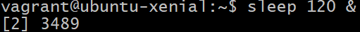
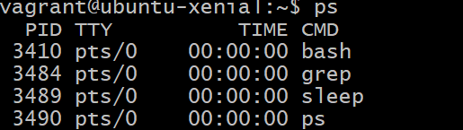
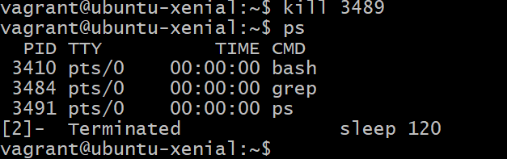

# Bash and Linux commands

Create a file
```bash
touch example.txt
```
Move or rename files (the file will retain its original type)
```bash
mv <file> <newfile>
```
note:
- Linux is case sensitive 

read file:
```bash
cat <file>
```
open and edit file:
```bash
sudo nano <file> or nano <file>
```
ctrl x + y + enter -- when you are done edititing file

this will also make the file if that file does not exist and put your content in it

----------------------------------------------------------------
Make a folder:
```bash
mkdir <folder1> <folder2> ....
```
don’t use space in file name or you will have to use “” initially and every time you want to enter that file

---
deletes file (removes):
```bash
rm <filename>
```


**warning!** : **never** do rm -rf, it will delete the entire system 

-rf forces the delete even if file is open :
```bash
rm -rf <filename>
```


---
makes hiddenfolder or file just add . infront:
```bash
mkdir .<foldername>
```


show all files including hidden 
```bash
ls -al
```


more information than -al including permissions
```bash
ls -all
```

wildcard will show certain files:
```bash
ls <startoffilename>*
ls *<endoffilename eg .txt>
```
Show permissions:
```bash
ls -l 
```
permissions r-read w-write x-execute:


```bash
drwxrwxr-x 2 vagrant vagrant 4096 May 10 15:11 documents
-rw-r--r-- 1 root    root      25 May 10 15:05 example2.txt
-rw-rw-r-- 1 vagrant vagrant   47 May 10 15:05 example3.txt
-rw-rw-r-- 1 vagrant vagrant   25 May 10 15:03 example.txt
```
1. first rw is owner who made the file
2. second is a group 
3. third is everyone else
---
gives everyone permission to execute a file:
```bash
cdmod u+x example.txt
```
permissions after:
```bash
drwxrwxr-x 2 vagrant vagrant 4096 May 10 15:11 documents
-rw-r--r-- 1 root    root      25 May 10 15:05 example2.txt
-rw-rw-r-- 1 vagrant vagrant   47 May 10 15:05 example3.txt
-rwxrw-r-- 1 vagrant vagrant   25 May 10 15:03 example.txt
```

gives everyone permission to anything to the file:
```bash
sudo chmod 777 example.txt
```
permissions after:
```bash
drwxrwxr-x 2 vagrant vagrant 4096 May 10 15:11 documents
-rw-r--r-- 1 root    root      25 May 10 15:05 example2.txt
-rw-rw-r-- 1 vagrant vagrant   47 May 10 15:05 example3.txt
-rwxrwxrwx 1 vagrant vagrant   25 May 10 15:03 example.txt
```


A permissions calculator -- [https://chmod-calculator.com/](https://chmod-calculator.com/)

---
```bash
head -2 <file>
```

Will show the first 3 lines of example.txt
>Note: head example.txt with no arugment would print first 10 lines.

```bash
tail -2 <file>
```

Will show the last 2 lines. 
>Example use case: Lets say your looking through a log file, you can use this to access the latest logs.

```bash
sort <file>
```

Will sort the lines alphabetically, numbers will be sorted and take precedence .

```bash
nl <file>
```

Shows line numbers

```bash
wc <file>
```

Shows line / word / character count 


>6 = lines 18 = words 54 = characters

```bash
wc -l <file>
```

Will give lines only

```bash
ls | head -3
```

. | Is known as a pipe, used for chaining many commands, these will show only the first 3 file, can be used in MANY ways


```bash
ls | tail -1
```

Will show the last file

```bash
ls | head -3 | tail -1
```

Will show the second file

```bash
cat <file> | grep hello
```

will only show lines with hello in them

```bash
ctrl + z
```

Will Stop a process, lets say if you are stuck

```bash
top
```

show you processes currently running and resources they’re using IN REAL TIME, this is a forground process than can be left by pressing **q**

```bash
ps 
```

Tell you the processes being used

```bash
ps aux 
```

Gives a snapshot of what’s running and how much resources those processes are using

```bash
sleep 120 &
```
120 - refers to 120 seconds and **&** refers to running in background



```bash
ps
```
Will show what processes are running and their PIDs




```bash
kill <process>
```
Kills a process


— if kill doesnt get rid of it then use:

```bash
kill -9 <PID process ID>
```
There are many reasons you would want to kill a process including a crash or the setup is wrong but to rerun the programme you have to to stop it from running in the background first

```bash
sleep 5
```
Would take your control for 5 seconds as it is a forground process not a background process(&)


```bash
fg <optional:processname>
```

brings the background process to the foreground

