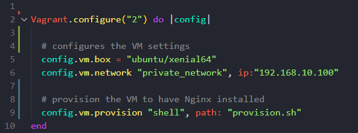

1. To make the vagrant file type the following command into the git bash console

```
vagrant init
```

2. After creation fill the vagrant file with following ruby code:
```ruby
Vagrant.configure("2") do |config|

  config.vm.box = "ubuntu/xenial64"
  config.vm.network "private_network", ip:"192.168.10.100"

end
```
3. Start the VM ( All following commands will be in the git bash terminal)
```
vagrant up
```
Your VirtualBox manager should look something like this:

1. Enter the VM terminal (Login)
```
vagrant ssh
```

1. Downloads updated package files and stores them somewhere accessible

```
sudo apt-get update
```

6. Update the packages with the files downloaded previously (-y flag used to answer yes to upcoming prompts, to make the process more automated) (sudo gives you admin privileges for that specific command)

```
sudo apt-get upgrade -y
```

7. Install nginx 
```
sudo apt-get install nginx -y
```

8. Start nginx
```
sudo systemctl start nginx
```
9. To check if nginx is running 
```
sudo systemctl status nginx
```
If it is running correctly will return something similar to: 

``` 
● nginx.service - A high performance web server and a reverse proxy server
   Loaded: loaded (/lib/systemd/system/nginx.service; enabled; vendor preset: enabled)
   Active: active (running) since Wed 2023-05-10 13:25:45 UTC; 1min 6s ago
 Main PID: 3324 (nginx)
   CGroup: /system.slice/nginx.service
           ├─3324 nginx: master process /usr/sbin/nginx -g daemon on; master_process on
           ├─3325 nginx: worker process
           └─3326 nginx: worker process

May 10 13:25:45 ubuntu-xenial systemd[1]: Starting A high performance web server and a reverse proxy server...
May 10 13:25:45 ubuntu-xenial systemd[1]: Started A high performance web server and a reverse proxy server.
May 10 13:26:08 ubuntu-xenial systemd[1]: Started A high performance web server and a reverse proxy server.
```
10.  Done: 
you can visit your nginx server on http://192.168.10.100/ 

11.  Optional: Destroy the server when finished with it.
```
vagrant destroy
```
# Using provisioning to automate the above steps:
1. Create a  file in the same folder as your 
2. In your provision.sh file write the code to identify which console the command will be run in, in our case its bash:
```sh
   #!/bin/bash
```
3. Then we can enter the rest of our commands that we used above:
```sh
sudo apt-get update -y
sudo apt-get upgrade -y
sudo apt-get install nginx -y
sudo systemctl start nginx
sudo systemctl status nginx
```
4. Then we go back to our  and type :
```ruby
config.vm.provision "shell", path: "provision.sh"
```
below the previous lines like so: 

This will tell vagrant to input our code into bash once the VM has started and it will automatically execute the commands and install nginx for us.